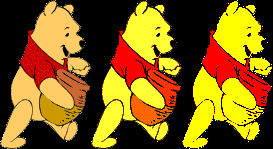

# Image Processing 2

Image Processing 2 is a project I realized in the first semester of my studies within the Programming Principles course at the Wroclaw University of Technology in the field of Control Engineering and Robotics. The main goal of this task was to develop the existing [Image Processing 1](https://github.com/kania99/Image_Processing_1) program so that it could also process colourful images in PPM format. In addition, it was necessary to provide the ability to process images directly from the command line. Image storage has been implemented using two-dimensional dynamic arrays.

## Table of Contents
- [Features](#features)
- [Screenshots](#screenshots)
- [Setup](#setup)
- [Usage](#usage)
- [Concepts I Learned](#concepts-i-learned)
- [Acknowledgements](#acknowledgements)
  

## Features

- Load PGM and PPM images with comment skipping,
- Save and display the processed image with an external program (ImageMagick),
- Processing images using command line arguments.
- Perform following image processing operations:
  - negative,
  - thresholding,
  - thresholding black,
  - thresholding white,
  - gamma correction,
  - change levels,
  - contouring,
  - horizontal and vertical blur,
  - converting to grayscale.


## Screenshots
Screenshots below represent results of chosen image processing operations.
On the left is the original image and then processed.

---

### Changing levels
Images processed for all colours and the new levels black 20% white 80% (second image) and black 40% white 60% (third image).



---

### Thresholding
Images processed for all colours and given threshold levels 20% (second image), 50% (third image), 80% (fourth image).


---

### Gamma correction
Images processed for all colours and given gamma parameters 0.5 (second image), 1.5 (third image), 2.5 (fourth image).


---

### Negative
Images processed for the selected colours red, green, blue, and all at once.


---


## Setup
Prerequisites:
* Installed CMake *(minimum VERSION 3.0)*,
* Installed ImageMagick.

Clone repository:

    git clone https://github.com/maciejkaniewski/Image_Processing_2.git

Create `build` directory and launch `CMake`:

    cd Image_Processing_2
    mkdir build
    cd build
    cmake ..

The above operation also creates the `images_results` folder.

Run `make` command and execute the program:

    make
    ./Image_Processing_2 

## Usage

### Operation via the text menu

After executing a program, the text menu will show up in the terminal:

    Image processing:
    
     1. Load image
     2. Save and display image
     3. Negative
     4. Thresholding
     5. Thresholding black
     6. Thresholding white
     7. Gamma correction
     8. Change levels
     9. Contouring
    10. Horizontal blur
    11. Vertical blur
    12. Convert to gray
    13. End program
    
    Select option:

By entering the numbers that are located next to each option, the options will be activated.

First, you need to load an image with *1st option*. The folder from which the program loads images is the `images` folder. You have to provide the file extension. You can then execute any processing operation. When it comes to operations on colourful images in PPM format, you need to additionally select the colour you want to process in the text menu that will show up in terminal:

    Colours:

    1. Red
    2. Green
    3. Blue
    4. All of them

    Select colour you would like to process: 

Each operation informs about its successful completion with an appropriate message. 
Then you can save the image with a name of your choice and display
it with *2nd option*. The program itself adds the `.pgm` or `.ppm` extension to the name. The folder where the images are saved is the `images_results` folder. 
Both the input and output folders can be changed in the `defines.h` file:

```C
#ifndef DEFINES_H_
#define DEFINES_H_

#define OK 0
#define INCORRECT_OPTION -1
#define NO_FILE_NAME -2
#define NO_VALUE -3
#define NO_FILE -4

#define LINE_LENGTH 1024 /* The length of the auxiliary buffers */
#define PGM_LINIE 70     /* Maximum line length in a PGM image, normally 70, for tests 20 */
#define INPUT_DIRECTORY "../images/"
#define OUTPUT_DIRECTORY "../images_results/"

#endif
```
If you want to re-execute the processing operation, you must reload the image, otherwise, the processing operation will be performed on the already processed image.

### Operation via the command line

Options available:
- `-i [file_name]` - file loading (if the `'-'` character is given instead of the `file_name`, the image is read from the standard input instead of the file)
- `-o [file_name]` - file saving (if the `'-'` character is given instead of the `file_name`, the image is printed on the standard output instead of to the file)
- `-d` - display image after processing
- `-m [colour]` - choose a colour for processing:
  - `r` - red
  - `g` - green
  - `b` - blue
  - `a` - all colours
  - `s` - gray conversion
- `-n` - negative
- `-t [threshold_level]` - **t**hresholding with a threshold with a given percentage value
- `-b [threshold_level]` - thresholding **b**lack with a threshold with a given percentage value
- `-w [threshold_level]` - thresholding **w**hite with a threshold with a given percentage value
- `-g [gamma_parameter]` - **g**amma correction with a coefficient of a given value
- `-l [white] [black]` - change of **l**evels
- `-c` - **c**ontouring
- `-h` - **h**orizontal blur
- `-v` - **v**ertical blur
  
#### Examples

Loading file from `stdin` and printing it to `stdout`:

    ./Image_Processing_2 -i - -o -
    P3
    4 4
    255
    0  0  0   100 0  0       0  0  0    255   0 255
    0  0  0    0 255 175     0  0  0     0    0  0
    0  0  0    0  0  0       0 15 175    0    0  0
    255 0 255  0  0  0       0  0  0    255  255 255
    P3
    4 4
    255
    0 0 0 100 0 0 0 0 0 255 0 255 0 0 0 0 255 175 0 0 0 0 0 0 0 0 0 0 0 0 0 15 175 0 0 0 255 0 255 0 0 0 0 0 0 255 255 255 %  

Loading file from `images` folder and saving it to `images_results` without processing:

    ./Image_Processing_2 -i pooh.pgm -o gray
    ./Image_Processing_2 -i pooh.ppm -o colour  

There is no need to enter the file extension, the program will add it itself.

Converting colourful image to gray and dispalying it:

    ./Image_Processing_2 -i pooh.ppm -o converted -m s -d

Processing PGM images:

    ./Image_Processing_2 -i pooh.pgm -o negative -n -d   
    ./Image_Processing_2 -i pooh.pgm -o threshold_80 -t 80 -d
    ./Image_Processing_2 -i pooh.pgm -o threshold_black_80 -b 80 -d
    ./Image_Processing_2 -i pooh.pgm -o threshold_white_20 -w 20 -d
    ./Image_Processing_2 -i pooh.pgm -o gamma_correction2.5 -g 2.5 -d
    ./Image_Processing_2 -i pooh.pgm -o levels60w_40b -l 60 40 -d
    ./Image_Processing_2 -i pooh.pgm -o contouring -c -d
    ./Image_Processing_2 -i pooh.pgm -o h_blur -h -d    
    ./Image_Processing_2 -i pooh.pgm -o v_blur -v -d

In the processing of PPM images it is similar to the PGM images, but you also need to select the `-m` option of the processed colour:

    ./Image_Processing_2 -i pooh.ppm -o negative_rgb -n -m a -d
    ./Image_Processing_2 -i pooh.ppm -o negative_rgb -n -m r -d
    ./Image_Processing_2 -i pooh.ppm -o negative_rgb -n -m g -d
    ./Image_Processing_2 -i pooh.ppm -o negative_rgb -n -m b -d

You can also convert a colour image to gray and perform the processing operation on it:

    ./Image_Processing_2 -i pooh.ppm -o negative_converted -n -m s -d


## Concepts I Learned

- The concept of dynamic memory, the procedure of its allocation and deallocation,
- The use of structures in C language,
- Handling command line arguments.

## Acknowledgements

Part of the `process_option()` was provided by our lecturer Robert Muszyński, BEng, PhD *(COPYRIGHT (c) 2007-2020 KCiR.)*
